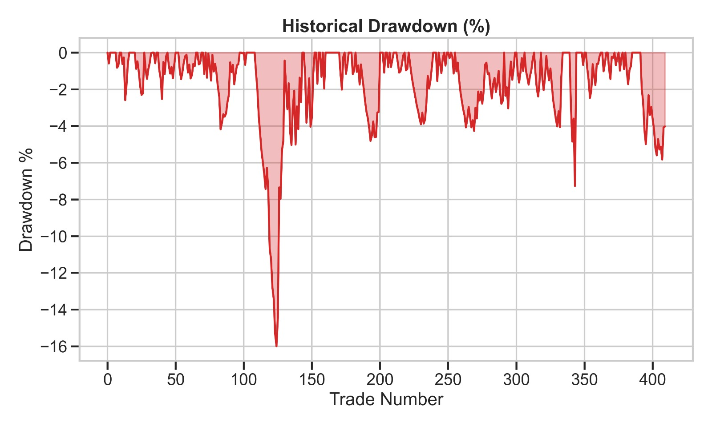
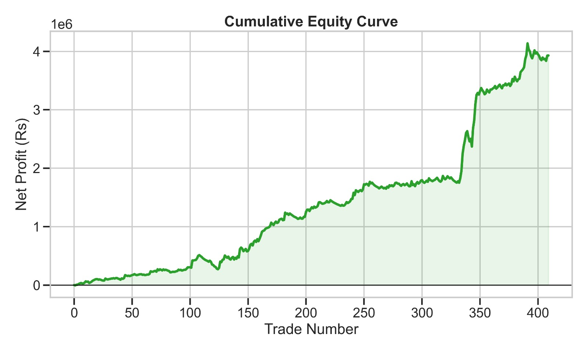
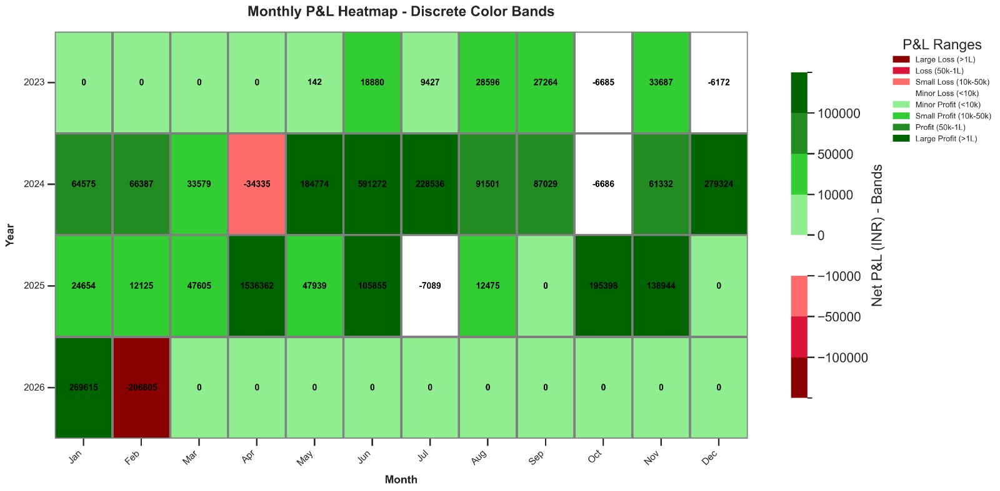
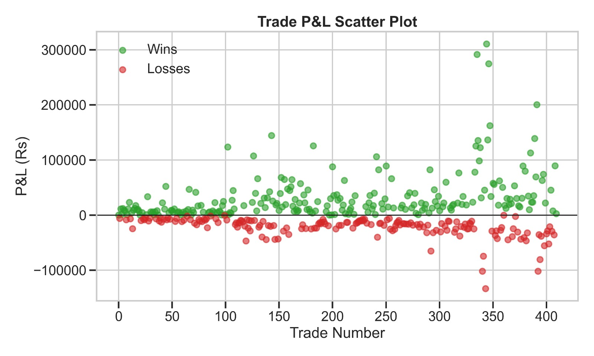
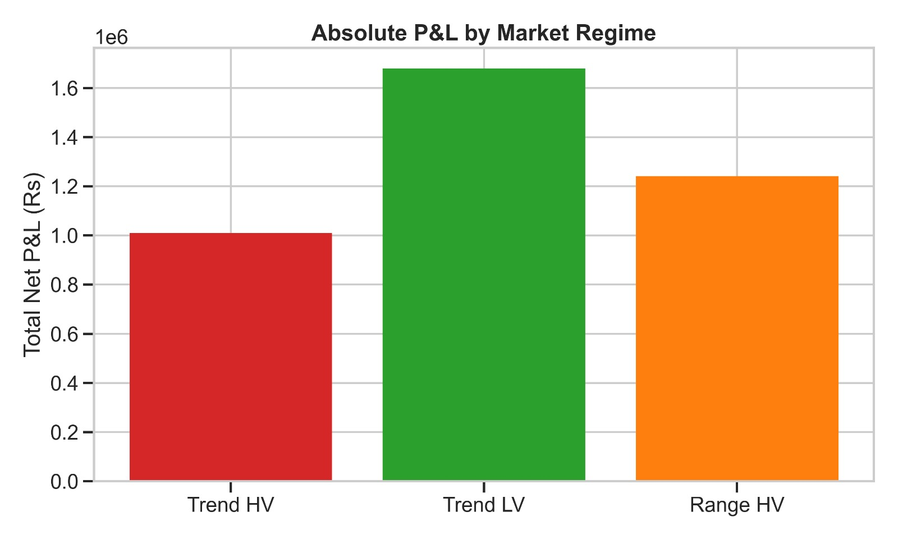
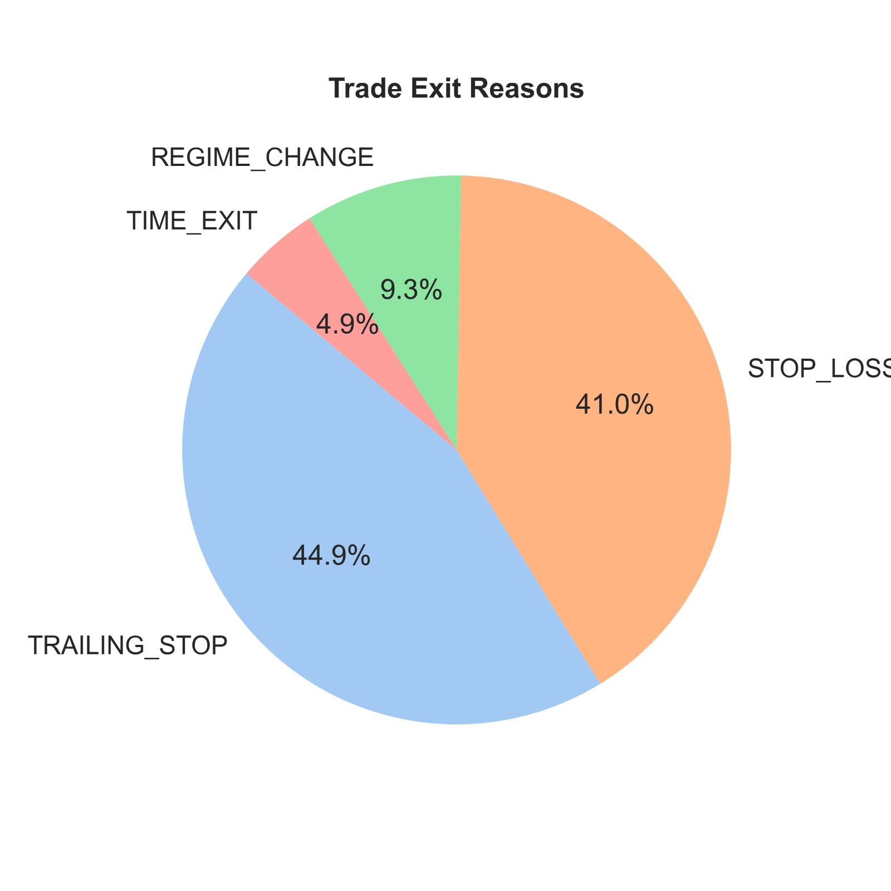
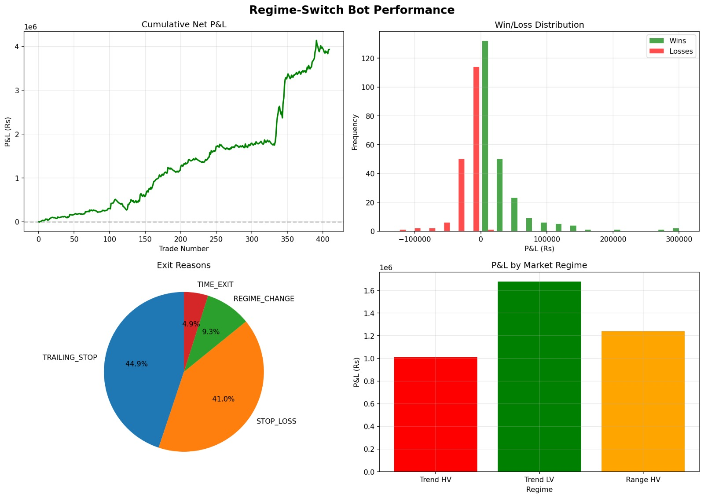

# ⚡ Regime-Switch ML Bot — NIFTY 5-Min Scalper



A production-grade **Streamlit dashboard** for a regime-aware, ML-driven NIFTY 50 intraday scalping strategy.  
Built from a walk-forward **RandomForest** model trained on 50,000+ five-minute bars, with dynamic position sizing, four-regime market classification, and institutional-level risk management.

---

## 📊 Performance Snapshot



| Metric               | Value          |
| -------------------- | -------------- |
| **Total Trades**     | 410            |
| **Win Rate**         | 57.07 %        |
| **Net P&L**          | ₹ 3,929,705    |
| **Profit Factor**    | 2.04           |
| **Max Drawdown**     | 15.99 %        |
| **ROI**              | 392.97 %       |
| **Sharpe Ratio**     | ~4.2           |
| **Sortino Ratio**    | ~7.2           |
| **Final Capital**    | ₹ 4,929,705    |

> Results exactly match the reference Jupyter notebook (`Final_straddle.ipynb`).

---

## 🏗️ Architecture

```
strem2/
├── app/
│   ├── main.py              # Streamlit entry point (9-tab dashboard)
│   ├── config.py             # All strategy constants & defaults
│   ├── data_loader.py        # CSV loading & cleaning
│   ├── strategy.py           # Feature engineering, ML training, backtest engine
│   ├── metrics.py            # P&L analytics & metrics computation
│   ├── plots.py              # 26 Plotly chart functions
│   ├── utils.py              # Custom CSS (Bloomberg dark theme)
│   ├── monte_carlo.py        # Bootstrap simulation
│   ├── regime_analysis.py    # 4-regime analysis & classification
│   ├── trade_replay.py       # Day-by-day trade replay
│   ├── iv_analytics.py       # Volatility analytics
│   └── robustness.py         # Stress tests & parameter sensitivity
├── cache/                    # Joblib ML model cache (auto-generated)
├── FINAL_NIFTY_MASTER_ATM_5min.csv   # Input data
├── Final_straddle.ipynb      # Reference notebook
├── requirements.txt
└── README.md
```

---

## 🚀 Quick Start

### 1. Clone & Install

```bash
git clone <repo-url> && cd strem2
python -m venv .venv
# Windows
.\.venv\Scripts\Activate.ps1
# macOS/Linux
source .venv/bin/activate

pip install -r requirements.txt
```

### 2. Place Your Data

Put `FINAL_NIFTY_MASTER_ATM_5min.csv` in the project root.  
Required columns: `datetime`, `spot`, `iv`, `CE_open .. PE_oi`, `Straddle_Price`.

### 3. Run the Dashboard

```bash
streamlit run app/main.py
```

The app opens at **http://localhost:8501** with a live, interactive dashboard.

---

## 🧠 Strategy Overview



### Market Regime Classification

The strategy classifies every bar into one of **4 regimes** using volatility and trend indicators:

| Regime       | ID | Sizing Multiplier | Description                        |
| ------------ | -- | ----------------- | ---------------------------------- |
| **Trend HV** | 0  | 1.0×              | Strong trend + high volatility     |
| **Trend LV** | 1  | 1.2×              | Strong trend + low volatility      |
| **Range HV** | 2  | 0.7×              | Mean-reverting + high volatility   |
| **Range LV** | 3  | **Blocked** (0×)  | Low-vol chop — no entries allowed  |

### ML Model

- **Algorithm:** RandomForest (100 trees, max depth 5)
- **Training:** Walk-forward with `TimeSeriesSplit` (5 folds)
- **Features:** 32 numeric features including spot price, options data, volatility regime, trend strength, momentum (5/10/20), z-scores, and volume ratios
- **Signal:** Probability of positive forward return > threshold

### Entry Rules

1. ML signal probability ≥ **0.32**
2. Market regime ≠ Range LV (regime 3 blocked)
3. Expected return (signal × 0.5%) > **0.0001**
4. Dynamic lot sizing via `RiskManager` (anti-martingale)

### Exit Rules

| Exit Type          | Condition                              |
| ------------------ | -------------------------------------- |
| **Stop Loss**      | Spot move < −0.15%                     |
| **Trailing Stop**  | Activate at +0.12%, trail by 0.05%     |
| **Time Exit**      | After 12 bars (60 min)                 |
| **Regime Change**  | Regime shifts while in profit          |

### Risk Management

- **Max risk per trade:** 1% of capital
- **Anti-martingale:** Position size shrinks by 10% per consecutive loss (floor: 60%)
- **Emergency stop:** Trading halts if drawdown exceeds 25%
- **Max lots capped** at 50 per trade

---

## 📈 Dashboard Tabs



| # | Tab                  | What It Shows                                            |
|---|----------------------|----------------------------------------------------------|
| 1 | **Overview**         | Strategy description, params, data summary, ML folds     |
| 2 | **Results & Equity** | Key metrics, equity curve, drawdown, monthly heatmap     |
| 3 | **Trades**           | Full trade log, P&L distribution, hourly analysis        |
| 4 | **Day Replay**       | Select any trading day and replay trades on price chart   |
| 5 | **Regimes**          | Regime distribution, P&L by regime, transition matrix    |
| 6 | **ML Analytics**     | Fold accuracy, feature importance, signal distribution   |
| 7 | **Monte Carlo**      | Bootstrap simulation (1000+ paths), probability analysis |
| 8 | **Rolling Sharpe**   | Multi-window rolling Sharpe ratio                        |
| 9 | **Robustness**       | Slippage & brokerage stress tests, parameter sensitivity |



---

## ⚡ ML Caching

Trained models are cached to disk via **joblib** in the `cache/` directory.  
On subsequent runs with the same data & config, the ML training step loads from cache in **<1 second** instead of retraining (~3-18s).

The cache key is a hash of:
- Data shape & target distribution
- ML hyperparameters (n_estimators, max_depth, n_splits, random_state)

Change any ML parameter in the sidebar → cache miss → fresh training → auto-cached.

---

## 🎛️ Sidebar Controls



All parameters are adjustable live in the sidebar:

| Section            | Parameters                                                  |
|--------------------|-------------------------------------------------------------|
| **Capital**        | Initial capital, lot size, max risk %                       |
| **Strategy**       | Stop loss %, trailing activation/distance, max hold bars    |
| **ML**             | Min signal prob, min expected return, RF trees/depth/folds  |
| **Costs**          | Slippage rate, brokerage per trade                          |

Changing any value triggers a pipeline re-run with progress tracking.

---

## 🔧 Configuration Defaults

All defaults live in [app/config.py](app/config.py) and match the notebook exactly:

```python
INITIAL_CAPITAL      = 1_000_000
LOT_SIZE             = 65
STOP_LOSS_PCT        = -0.0015      # -0.15%
TRAILING_ACTIVATION  = 0.0012       # +0.12%
TRAILING_DISTANCE    = 0.0005       # 0.05%
MAX_HOLD_BARS        = 12           # 60 minutes
MIN_SIGNAL_PROB      = 0.32         # Entry threshold
N_ESTIMATORS         = 100
MAX_DEPTH            = 5
N_SPLITS             = 5            # Walk-forward folds
SLIPPAGE_RATE        = 0.001        # 0.1% of gross P&L
BROKERAGE_PER_TRADE  = 40           # ₹40 flat
```

---

## 📦 Requirements

```
streamlit>=1.30
pandas>=2.0
numpy>=1.24
scikit-learn>=1.3
plotly>=5.18
joblib>=1.3
```

Install with: `pip install -r requirements.txt`

---

## 🧪 Validation



Run the validation script to verify P&L matches the notebook:

```bash
python test_pipeline.py
```

Expected output:
```
Total Trades: 410
Win Rate: 57.07%
Net P&L: Rs 3,929,705.19
Max Drawdown: 15.99%
ROI: 392.97%
```

---

## 📝 Notes

- **Data period:** 2023-05-23 to 2026-02-13 (~51,000 five-minute bars)
- **No lookahead bias:** All features use `.rolling()`, `.pct_change()`, and `.shift(-N)` for targets only
- **Walk-forward validation:** Each fold trains on past data only, tests on unseen future data
- **Exact notebook reproduction:** Every trade, every metric, every exit reason matches `Final_straddle.ipynb`

---

<p align="center">
  <b>⚡ Built for institutional quant research</b><br>
  Walk-Forward RandomForest &bull; 4-Regime Classification &bull; Dynamic Position Sizing
</p>
